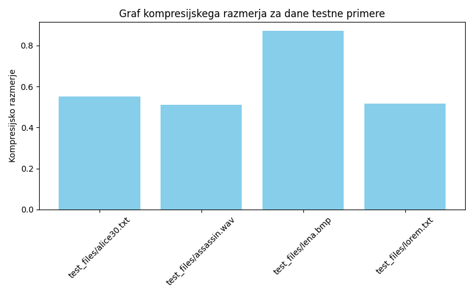
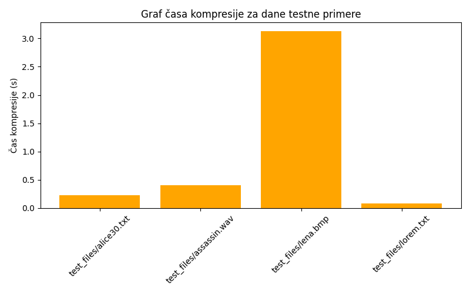
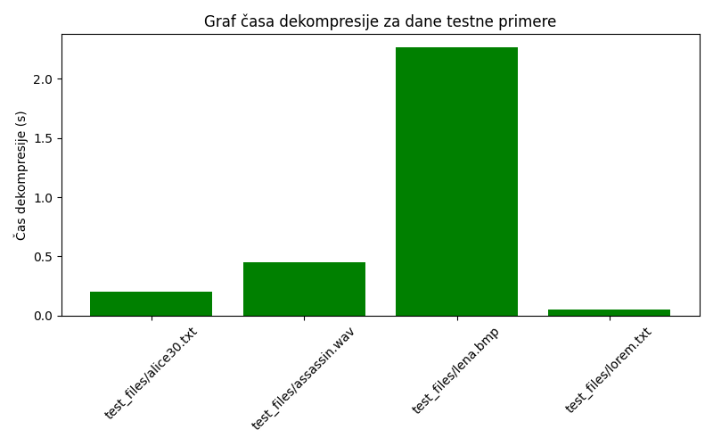

# Računalniška multimedija - Vaja 1 - Aritmetični kodirnik

V tej vaji smo implementirali aritmetični kodirnik.

### Opis kodiranja tabele vrednosti
Vsak znak se shrani v tabeli `TableEntry`, ki vsebuje:

- `character`: znak
- `frequency`: število pojavitev
- `lowerBound`: spodnja meja kumulativne frekvence
- `upperBound`: zgornja meja kumulativne frekvence

Interval `[lowerBound, upperBound]` določa del intervala, ki ga znak kodira med kompresijo. Tako je mogoče med dekompresijo hitro najti ustrezen znak.

**Zapis tabele v `output.bin`:**

1. Najprej se zapiše število bitov kodirnika (`bitSize`) kot `int`.
2. Nato se zapiše število različnih znakov (`tableSize`).
3. Za vsak znak se zapiše:
   - `character` (1 bajt)
   - `frequency` (4 bajti, `int`)

Ta zapis omogoča, da dekompresijski program hitro prebere tabelo in ponovno izračuna `lowerBound` in `upperBound` za vsak znak.

### Predlogi za pohitritev algoritma
- Shranjevanje frekvenc z manjšimi tipi (`uint16_t`) za manjši header.

\pagebreak
## Analiza implementacije

